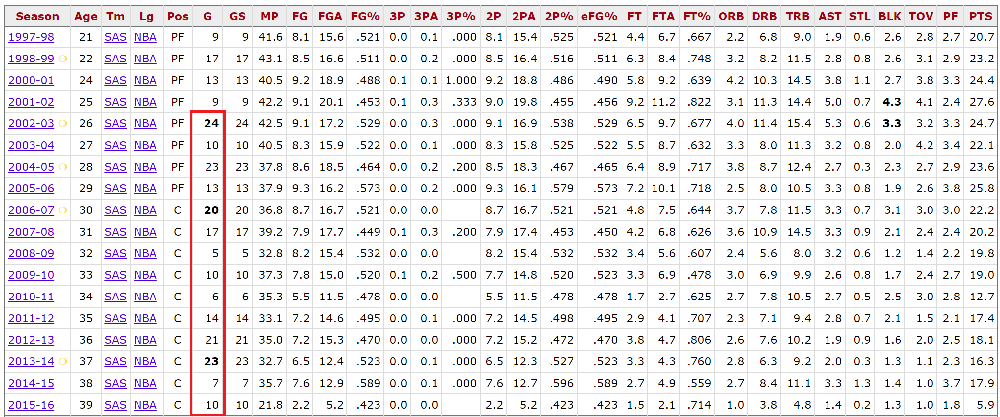

# Interesting questions and (possible) answers

## Question 1

Given the number of NBA playoff games a team played in a season, can we (if yes, how to) determine which rounds (R1, CSF, CF, F) the team advanced to?

For example, the highlighted column in the table below (from [here](https://www.basketball-reference.com/players/d/duncati01.html)) 
shows the number of playoff games Tim Duncan played in each season of his career after 2002 (R1 was extended to a best-of-seven series in 2003).

It turns out that some of the numbers can, others don't, see the codes for more details.
